# Vibe Code Camp

[](https://github.com/tpetedb/vibe-map/actions/workflows/ci.yml)
[](https://github.com/tpetedb/vibe-map/releases)
[](LICENSE)
[](https://tpetedb.github.io/vibe-map/)

From intern to expert in one evening, with wine. A 3D island you walk across, eight workstreams that each leave something real on your machine, a terminal companion that checks your work and awards XP, and an Obsidian vault that grows as you go.

**What it is.** A course you play. Four evenings, four islands, thirty-two stops. Every stop ends with something on your disk that a command can verify, so "done" is a green check and not a feeling.

**Who it is for.** People who are not (yet) engineers and want to start with AI coding agents properly: a chief of staff, the CEO of a cleaning company, a university managing director, a teacher, an interior stylist, a data engineer. No terminal experience is assumed. An evening is.

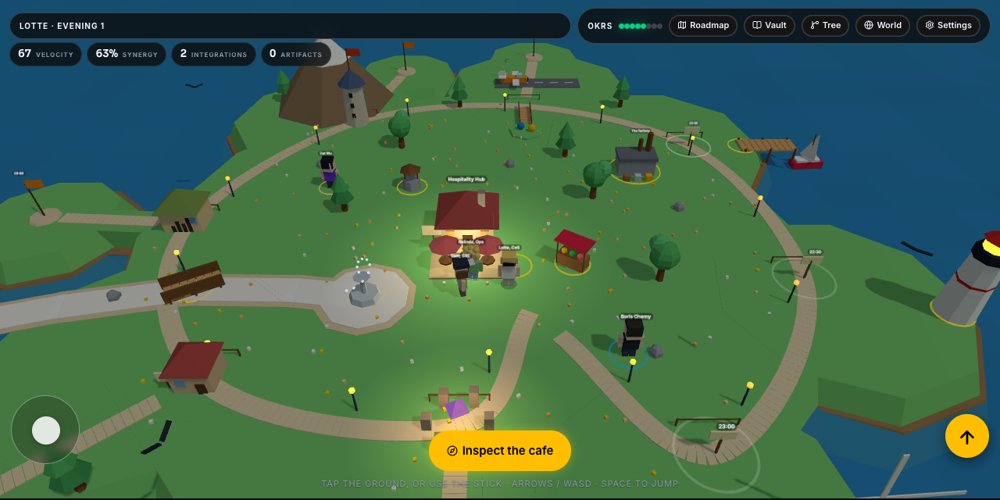

## Play it now

**[tpetedb.github.io/vibe-map](https://tpetedb.github.io/vibe-map/)** opens the game in your browser. Nothing to install, no account, no key: the progress lives in that browser and comes out as a code you can paste elsewhere.

Supported browsers: Chrome is the one the game is built and fixed for, on desktop and on Android. On an iPhone it is best effort, because every iPhone browser runs Apple's WebKit; the game is tested against a WebKit iPhone profile and gets no Safari-only polish. Firefox and desktop Safari should work and are not tested beyond that.

Offline instead? It is one file, with three.js embedded and no CDN, so it runs from your downloads folder on a Mac, a phone or a locked-down laptop:

```bash
curl -fsSL https://raw.githubusercontent.com/tpetedb/vibe-map/main/game/vibe-map.html -o vibe-map.html
open vibe-map.html        # macOS; anywhere else, double-click it
```

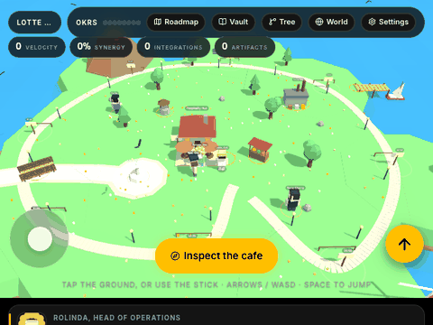

## The full evening: the game, your terminal and your notes

The game is the map and the manual. The `vibe` command is the part that looks at what you actually built, awards the XP and writes the notes. Install it once, then make a camp of your own:

```bash
brew install uv git                                        # macOS; uv and git are the whole prerequisite
uv tool install git+https://github.com/tpetedb/vibe-map    # puts `vibe` on your PATH, no clone needed
vibe new                                                   # your camp, in the current folder: vibe-map-<you>-<today>
cd vibe-map-*
vibe status                                                # your name, level, XP and the four-by-eight grid
vibe play                                                  # the game, with your camp behind it
```

Step by step, with what you should see after each command: [docs/QUICKSTART.md](docs/QUICKSTART.md). The three windows and one loop over weeks: [docs/LONG-GAME.md](docs/LONG-GAME.md). The repository is the install source until the package is published; once it is on PyPI, `uv tool install vibe-map` is the short form of the same thing. `VIBE_HOME` points the command at a camp from elsewhere.

### What you need, honestly

- **A terminal.** Every instruction is written for macOS on Apple silicon, which is what the course was built on. Linux works. Windows is untested.
- **uv and git.** That is the whole install. `vibe` carries the campaign, the tech tree, the resources and the camp template inside the package.
- **Your own coding agent, on your own account.** From workstream 2 onwards the course assumes one: Claude Code, Codex, Gemini CLI, Copilot CLI or OpenCode. You bring your own subscription and you pay for your own usage; nothing here is billed to this project or its owner, and no key of ours is in the game or the CLI. `vibe provider <id>` tells the CLI which one you have, and it is only ever run in print mode, by you, on your machine.
- **A camp of your own.** `vibe new` writes one into a folder you own. If you want the engine as well, press **Use this template** on GitHub and work in your own repository. Nothing you do reaches this repository unless you open a pull request.
- **Optional, and only per workstream.** GitHub CLI (`gh`), DuckDB, Obsidian and `just`. `vibe toolbelt` says what is missing and gives the install command; nothing installs itself.

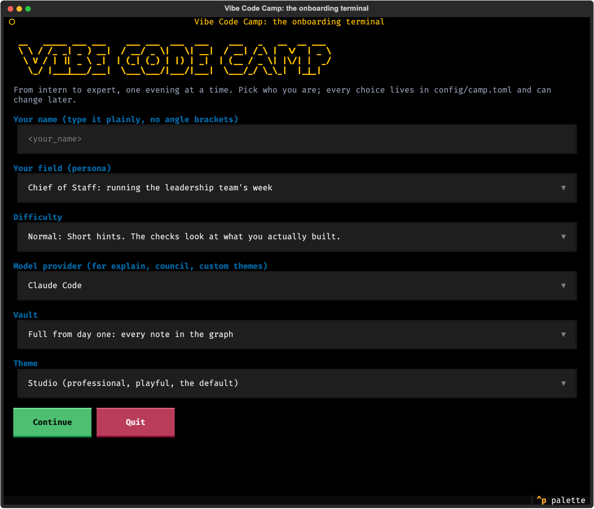

The game onboards on its own too. A first visit asks who you are (Lotte, Frank, Max, Rolinda or your own name), how hard, and whether you want just the game or the full experience; the last one prints the exact terminal commands with your name and today's date filled in, folder convention included: `vibe-map-<name>-<YYYY-MM-DD>`.

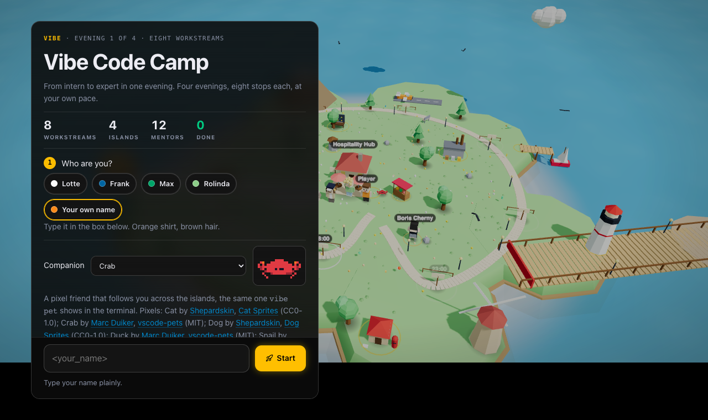

### A few more ways to start a camp

```bash
vibe new ~/camp --github you/camp # a named folder, pushed to a new GitHub repository
vibe new ~/camp --github you/camp --private   # the same, private (Pages needs GitHub Pro)
vibe play --offline               # cache the game next to the camp and open that copy
```

`vibe` finds the camp from any subfolder, so `vibe status` works wherever you are inside it.

## What is in the box

Three zones, on purpose. The **product** is the engine and lives here. The **template** is what a camp starts from and ships inside the `vibe` command. Your **workspace** is the folder that is yours. A learner never needs the first one: `vibe new` writes a slim camp (the template's files and a built vault, no engine, and it prints the count as it copies), the game is hosted, the command is installed. [docs/MAINTAINERS.md](docs/MAINTAINERS.md) has the map and how a change in one zone reaches the others.

| Path | Zone | What |
|---|---|---|
| `game/vibe-map.html`, `src/` | product | The game, built from `src/` by `just build`. |
| `vibemap/` | product | The terminal companion: quests and XP, personas, themes, toolbelt, providers, council, the vault builder, the onboarding screen. |
| `vibemap/data/template/` | template | The camp skeleton `vibe new` copies: README, AGENTS.md, `config/camp.toml`, justfile, the learner skills, the hook, the Pages workflow, an empty `workspace/`. |
| `workspace/` | workspace | The learner's own zone: the game from workstream 1, the scores and their queries. Here it holds the worked example. |
| `vault/` | product | An Obsidian vault, pre-configured and lint-clean, over 130 notes on day one. |
| `.agents/skills/` | configuration | Fifteen skills in the Agent Skills standard, linked into `.claude/skills/` by `just setup`. |
| `docs/` | product | [The brief](docs/BRIEF.md) (every request, what happened, the plan), [Maintainers](docs/MAINTAINERS.md), [Quickstart](docs/QUICKSTART.md), [About](docs/ABOUT.md), [Syllabus](docs/SYLLABUS.md) (also published at [tpetedb.github.io/vibe-map/syllabus.html](https://tpetedb.github.io/vibe-map/syllabus.html)), [Roadmap](docs/ROADMAP.md) (the tech tree, every date sourced), [Cookbook](docs/COOKBOOK.md), [Design](docs/DESIGN.md), [Ecosystem](docs/ECOSYSTEM.md), [Vault](docs/VAULT.md), [Note methods](docs/NOTE-METHODS.md), [Skills](docs/SKILLS.md), [Age of Epochs study](docs/AOE-STUDY.md), [ADRs](docs/adr/README.md), [Media](docs/media/README.md) (what each image shows and what renders it). |
| `tests/` | product | Pytest: CLI, build, Chromium and WebKit iPhone smoke tests, the onboarding screen, and a full play-through of every path. |
| `justfile` | configuration | Every task, for people and for agents. `just` lists them. |

## What one evening leaves behind

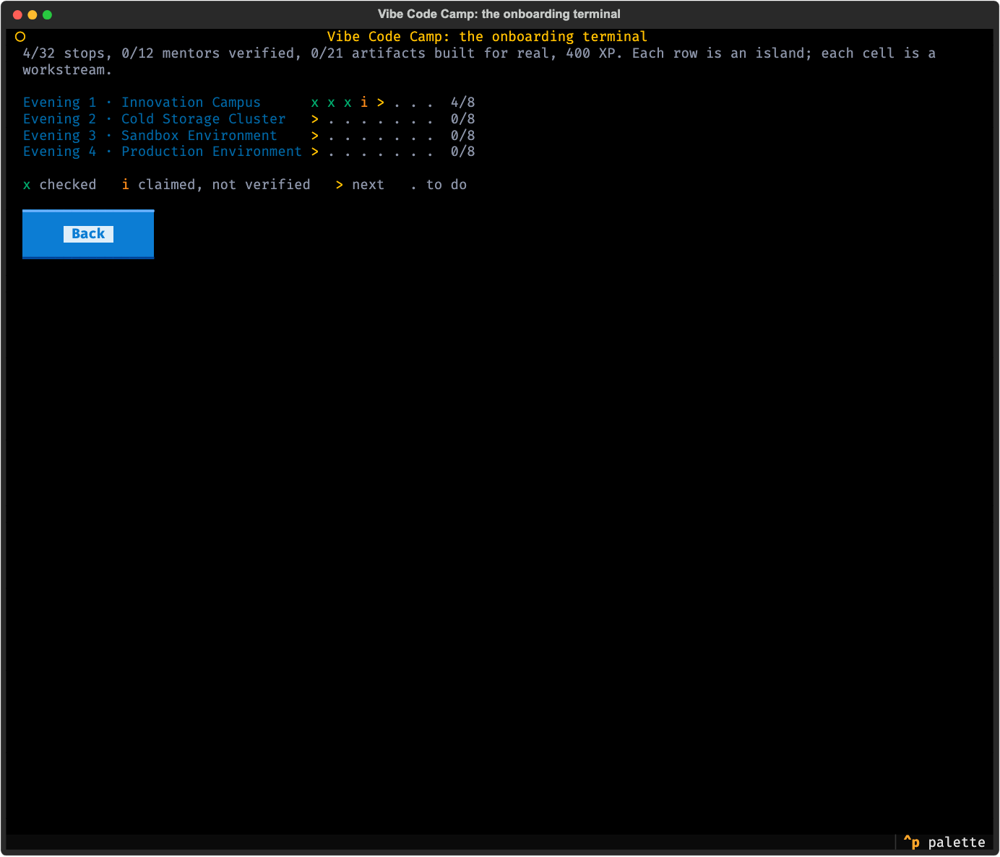

| Time  | Workstream            | You end up with                                      | The check |
|-------|-----------------------|------------------------------------------------------|-----------|
| 18:00 | Innovation Hub        | a playable single-file game                          | `workspace/game/index.html` is no longer the placeholder |
| 19:00 | Centre of Excellence  | AGENTS.md rules and a first skill                    | eight lines of rules, one valid SKILL.md |
| 20:00 | Data Warehouse        | scores.csv, DuckDB queries, a Python chart           | rows in the CSV, a query, a script |
| 21:00 | Business Continuity   | git history, a rollback, one hook                    | three commits and a hooks block |
| 21:30 | Stakeholder Bridge    | one MCP integration                                  | a server in `.mcp.json` |
| 22:00 | Knowledge Tree        | a linked vault and its graph                         | six notes, twelve links, no dead ones |
| 22:30 | Go-to-Market          | the game at a public URL                             | a Pages workflow or a live Pages site |
| 23:00 | Autonomous Operations | headless Claude on a schedule, a subagent            | a subagent file and a schedule |

`uv run vibe check 3` runs the checks for a workstream and awards the XP when they pass. Levels are the XP ladder: Intern, Junior, Medior, Senior, Expert. Four evenings, four islands, thirty-two stops, twelve mentors from the field who stand on the islands with their real ideas and sources.

## Twenty-one things on the islands that explain one idea each

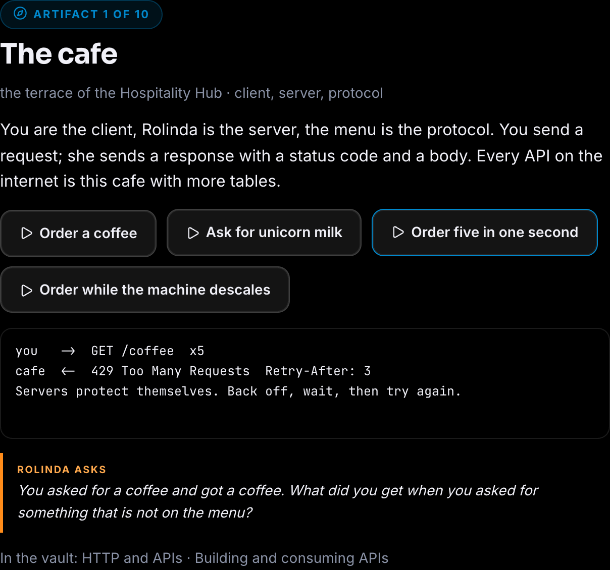

Walk up to a yellow ring and press **Inspect**. On the campus, the cafe serves a coffee the way a server answers a client (200, 404, 429, 503, with the latency); the fountain is a cache (miss, hit, stale, invalidate); the well is a database (a scan, an index, a transaction); the lighthouse is DNS; the dock packs, ships and unloads a container; the windmill is cron; the balloon is the cloud with its meter running; the mountain is the stack, six layers from the chip to the agent; the market stall is an API with a menu; the bridge is MCP. Each one prints its demo like a terminal, ends with a question from Rolinda, and links the vault note that goes deeper. Found ones turn green, travel in the progress code, and earn the Collector badge.

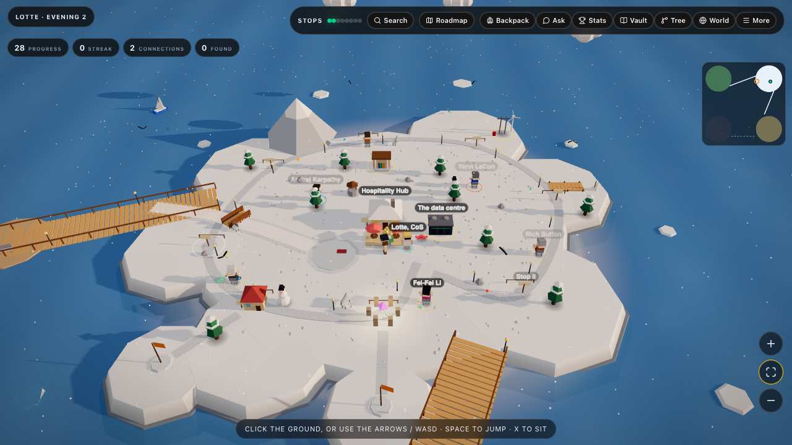

The second wave is spread over the four islands, and each one is a small building the walker has to go round. Campus: the factory (a data pipeline, raw to bronze to silver to gold, a failed run that reruns cleanly), the post office (queues and pub/sub, a subscriber that was offline, at-least-once delivery, the dead-letter shelf) and the switchboard (a justfile, the labels behind `just --list`, a parameter with a default, a dependency that runs first, a confirm guard on the switch that cuts the power). Sandbox: the shop (a package registry, `uv add` as buying, `uv.lock` as the receipt, a yanked version) and the bank (secrets and auth, a token is a key, `.env` is the safe, a leaked key revoked and rotated). Cold storage: the data centre (where the model runs, an inference request's path, latency by region, a cold start, batch versus interactive), the energy grid (tokens as watts, a rate limit as a fuse, autoscaling, a budget alarm) and the library (RAG, a question becomes a vector, the nearest shelves, a citation, a stale index). Production: the office (a team of agents, planner, worker and reviewer, `AGENTS.md` as the handbook, a review gate that rejects, subagents as departments), the households (users and privacy, data minimisation, anonymisation, a GDPR request answered) and the school (training a model, train and test split, overfitting caught by the test, a benchmark score).

## Make it yours

- **Persona.** `uv run vibe persona data-engineer` tunes the example game, the dataset, Rolinda's questions and the recipes to your field. Six presets: chief of staff, cleaning-company CEO, university managing director, pabo teacher, data engineer, interior stylist.
- **Difficulty.** `uv run vibe difficulty hard`: beginner and easy spell every command out, hard and expert add strict and extra checks, god adds the whole gate on top: `just verify` in a checkout of this repository, the vault lint plus your own tests in a camp.
- **Theme.** `uv run vibe theme boardroom` swaps the wine-night jargon for a serious voice; `--create` asks your provider to write a new one into `themes/`.
- **Provider.** Everything that talks to a model (`explain`, `council`, custom themes) uses the CLI you chose, in print mode.
- **Obsidian, feature by feature.** `uv run vibe vault feature --all` writes one note per Obsidian feature (links, properties, callouts, canvas, bases, templates, daily notes, bookmarks, search, hotkeys, workspaces, slides, URI, CLI, Sync, Publish and more) with the exact commands and a five-minute try from the official help, plus working example files: a canvas, a base, a template, a deck, a CSS snippet. The table: [docs/OBSIDIAN.md](docs/OBSIDIAN.md).
- **Dashboard.** The Stats button on the HUD opens a panel of KPI tiles with sparklines, a ring per island, XP over time, a day-by-hour heatmap, time per stop, the path you took and a feed of recent events, all drawn from an event log the game keeps in this browser. In the terminal, `uv run vibe dashboard` (or `just dashboard`) writes the same design into `workspace/dashboard.html` from your state, your vault and your scores, and `--json` prints the numbers. [How the two views derive their numbers](docs/DASHBOARD.md).
- **Avatar and Backpack.** Walk over collectibles, sit down with the laptop and wear the rewards that achievements unlock. Inventory, achievements and wardrobe travel in the progress code. [What is saved and what the scene derives](docs/AVATAR.md).
- **Archipelago.** The four islands stay in one scene, joined by bridges that open with progress and can be crossed with the normal movement controls. The World button remains fast travel. [How crossing, state and accessibility fit together](docs/ARCHIPELAGO.md).
- **Settings, in the game.** The Settings button on the HUD: map size (compact, big, the whole window), full screen, vault mode, pairings on or off, shadows, motion, walking speed. They apply at once and stay in the browser.
- **The live world.** `just news` (or `uv run vibe news` then `just build`; in a camp the feed lands in `.vibe/news.json` and the vault note News) pulls the sources in `vibemap/data/sources.json`, twenty-one verified feeds from Apple, Microsoft, kernel.org and LWN, Python, Markus Winand, DuckDB, GitHub and the release feeds of just, uv, ruff, three.js, Claude Code and Codex, into `data/news.json` and the vault note News. Every name is plain text with a link to the publisher's own words, never a logo and never an invented quote (`docs/adr/0010-real-names-and-live-content.md`). The Roadmap shows the latest items; a daily GitHub Action keeps a forked repo and its hosted game current, which refreshes `./news.json` from its own origin. Turn it off with `[news] live = false` in `config/camp.toml` or the Live world dropdown in Settings; add feeds of your own under `[news] feeds`.
- **Grow mode.** `uv run vibe vault mode grow` empties the vault down to its hubs and keeps every note in `vault/_library` (hidden from Obsidian's graph and search). Notes come back as you play: a workstream's notes when its stop is done, an artifact's notes when you inspect it, a mentor when you go deep, the Obsidian feature notes when the vault stop is done, or any note by hand with `vibe vault unlock`. The in-game vault follows the same rules, so you watch the graph grow. `vibe vault mode full` brings everything back.
- **Note-taking.** `uv run vibe vault method zettelkasten` bootstraps a method into the vault: Zettelkasten, PARA, Johnny.Decimal, LYT, Evergreen, Cornell, Bullet Journal, or daily notes with a weekly review.

Every knob of your journey lives in `config/camp.toml`; delete the file and everything still works. The game's own configuration is `src/config/`, and `docs/CONFIG.md` is the table of which is which.

## A pet in the terminal

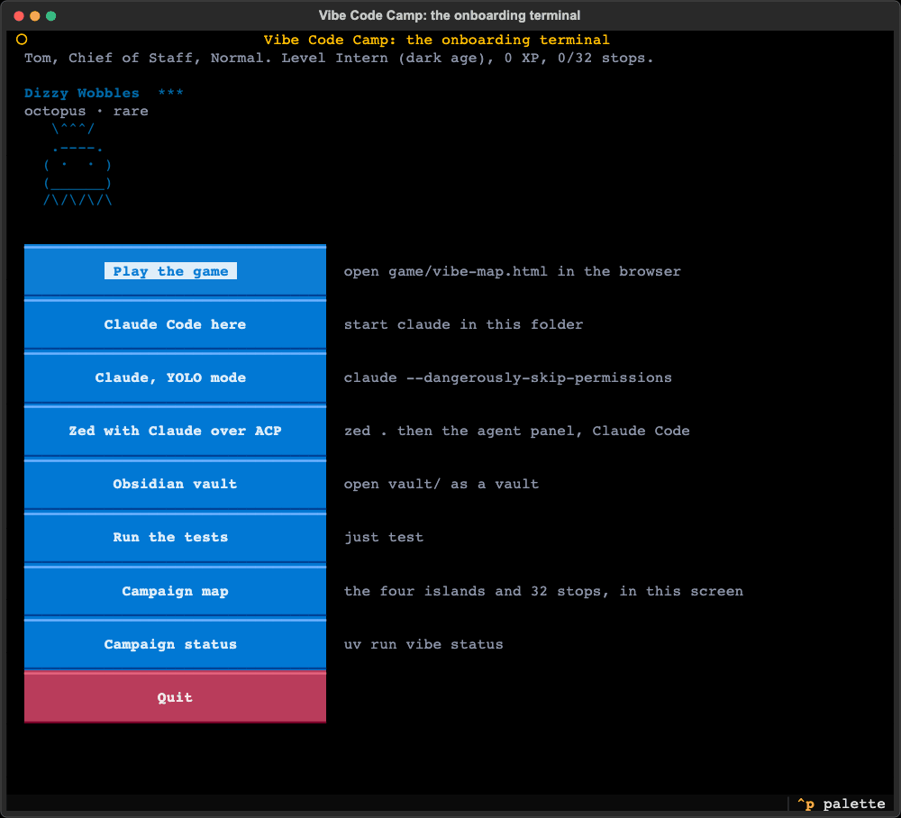

```bash
uv run vibe pet                       # the creature your name rolled, with its stats
uv run vibe pet --watch               # it walks and fidgets until Ctrl-C
uv run vibe pet --species cat --name Pinch --hat crown
uv run vibe pet --style ascii         # the art instead of the pixels
uv run vibe pet --all                 # the gallery: twenty species
```

### The six with pixels


| | | |
|---|---|---|
| 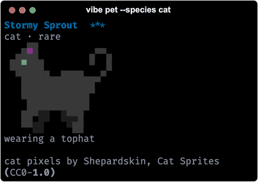 | 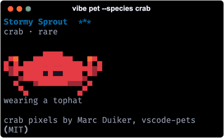 | 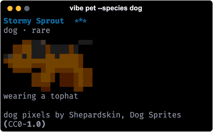 |
| `--species cat` · [Shepardskin](https://opengameart.org/content/cat-sprites), CC0 | `--species crab` · [Marc Duiker](https://github.com/marcduiker), MIT | `--species dog` · [Shepardskin](https://opengameart.org/content/dog-sprites), CC0 |
| 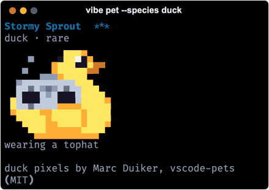 | 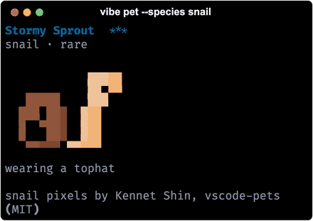 | 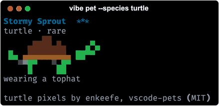 |
| `--species duck` · [Marc Duiker](https://github.com/marcduiker), MIT | `--species snail` · [Kennet Shin](https://github.com/WoofWoof0), MIT | `--species turtle` · enkeefe, MIT |

These six are real pixel sprites, painted two pixels to a cell with half blocks and animated at eight frames a second, with four states: idle, walk, happy and sleep. The crab, duck, turtle and snail come from [vscode-pets](https://github.com/tonybaloney/vscode-pets) (MIT, Anthony Shaw); the cat and the dog are two CC0 packs by [Shepardskin](https://opengameart.org/users/shepardskin) on OpenGameArt. The licence and the per-set credit sit next to the frames in `vibemap/data/pets/`, and every picture above is real terminal output, rendered by `tools/tui_media.py`.

The other fourteen species (goose, blob, dragon, octopus, owl, penguin, ghost, axolotl, capybara, cactus, robot, rabbit, mushroom, chonk) keep the ASCII art, and so does any terminal without truecolor or with `NO_COLOR` set: `style = "ascii"` in `[pet]` makes that the rule everywhere.

The six with pixels are in the browser game too, hosted build included: pick one in the onboarding or under Settings, Companion, and it follows you across the islands and over the bridges. The choice travels in the progress code both ways, so a companion chosen in the terminal arrives in the game. It also strolls across the launch screen of `just start`, sits next to `vibe status`, and does a happy little turn whenever `vibe check` or `vibe done` claims a stop. Same name, same creature: the roll is the one from claude-buddy, so a name that hatched a snail in Claude Code hatches the same snail here. Everything is overridable in `config/camp.toml` under `[pet]`, including `style = "pixel" | "ascii"`, or switch it off with `--off`.

## Your terminal, Tom's way

```bash
uv run vibe dotfiles                       # six modules and whether they are in place
uv run vibe dotfiles show zsh              # the files, the brew line, what to do after
uv run vibe dotfiles install zsh --brew    # completion dropdown, fzf, highlighting, one line in ~/.zshrc
uv run vibe dotfiles install --all         # tmux bar, Ghostty theme, Starship prompt, AeroSpace, the R2-D2 Obsidian theme
```

Adapted from Tom's own toolbox (MIT), which is not a public repository, so the modules travel with this one in `vibemap/data/dotfiles/` with their licence. Anything that already exists and differs is backed up next to itself first. The same screen lives in `just start` under Terminal setup.

## Break things on purpose

```bash
just break sandbox          # a play/sandbox branch, a sandbox
uv run vibe explain     # your provider explains the last commits in plain words
just rescue                 # back on main, nothing lost
uv run vibe council "Should I learn git before Python?"   # the island's mentors answer, review each other, a chairman decides
```

## Work on the engine itself

Most people do not need to: `uv tool install git+https://github.com/tpetedb/vibe-map` and `vibe new` give you a camp without the engine. Press **Use this template** on GitHub when you want the engine (to change the game, the checks or the course), then work in your own repository:

```bash
brew install just
just setup     # Homebrew tools, uv and the Python env, Playwright browsers, skills, the vault
just start     # the onboarding screen: who you are, what the machine has, where to go
just verify    # ruff, the pytest battery with Playwright, the build check: the gate before a commit
```

A checkout is also a valid camp, which is how the tests and the played instance work. To see what a finished campaign looks like, open [vibe-map-played](https://github.com/tpetedb/vibe-map-played): the same template after every island, stop and mentor was played, with its state, vault and progress code committed. The repository practises what it teaches: [CHANGELOG.md](CHANGELOG.md) in Keep a Changelog form, decisions in `docs/adr/`, the version in `pyproject.toml`, CI and Pages as GitHub Actions in `.github/workflows/`, secrets in a gitignored `.env` next to `env.example`.

## For agents

Read [AGENTS.md](AGENTS.md) for the conventions and the test loop, [docs/MAINTAINERS.md](docs/MAINTAINERS.md) for the three zones and how a change travels, and [docs/BRIEF.md](docs/BRIEF.md) for what was asked for and why. `just verify` is the gate before a commit.

## Credits and licences

MIT. three.js (MIT), [Motion](https://motion.dev) (MIT), [d3-force](https://d3js.org/d3-force) (ISC, the vault graph) and [Lucide](https://lucide.dev) icons (ISC) are embedded in the game. The terminal pet's ASCII art, idle animation and name roll are ported from [claude-buddy](https://github.com/btcromesh/claude-buddy) by Romesh Niriella (MIT), itself extracted from the /buddy feature Claude Code shipped for a week in April 2026; the ASCII crab is ours. The pixel sprites for the crab, duck, turtle and snail are vendored from [vscode-pets](https://github.com/tonybaloney/vscode-pets) by Anthony Shaw (MIT) and drawn by [Marc Duiker](https://github.com/marcduiker), enkeefe and [Kennet Shin](https://github.com/WoofWoof0); the cat and the dog are [Cat Sprites](https://opengameart.org/content/cat-sprites) and [Dog Sprites](https://opengameart.org/content/dog-sprites) by [Shepardskin](https://opengameart.org/users/shepardskin), both CC0. What was taken, what was left behind and why is in `vibemap/data/pets/CREDITS.md`. Two vendored skills keep their licences next to them (Anthropic's webapp-testing, Apache-2.0; obra's verification-before-completion, MIT). The idea for the tech tree is Age of Empires; the study of a real browser AoE, sokrypton/aoe, is in the docs, ideas only.
