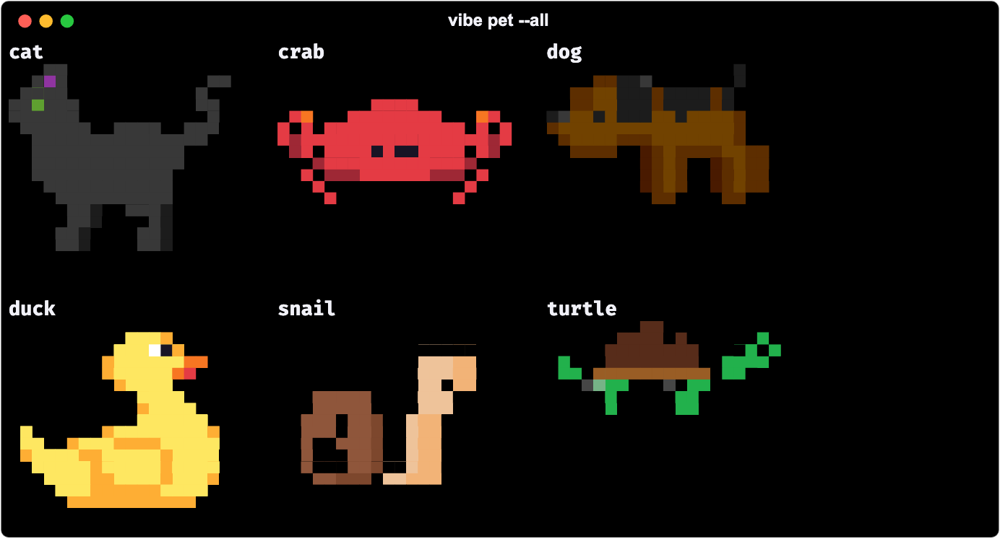

# About

Vibe Code Camp is Tom Peters' answer to a question his family kept asking: how do you actually start with this AI stuff. Tom is a data engineer; the people asking were a chief of staff, the CEO of a cleaning company, a university managing director, a teacher at the pabo and an interior stylist. None of them wanted a course. All of them wanted an evening.

## The premise

One evening, one island, eight workstreams. Every workstream leaves something real on the machine: a game, a rules file, a dataset with queries, a git history, one integration, a vault, a public URL, an agent on a schedule. The game is the map and the manual; the terminal companion checks the work and keeps score; the Obsidian vault is the memory. Nothing is simulated: `vibe check 3` opens the real CSV and runs the real query.

The tone is corporate satire with one honest voice. Tom speaks like a steering committee; Rolinda, Head of Operations, asks the question everyone else is too polite to ask. Done is a green check and one sentence you can explain to Rolinda.

## Why it looks like this

The design follows Tom's own machine. Black is the background, always; five hues each mean one thing:

| Hue | Hex | Means |
|---|---|---|
| red | `#D32F2F` | action, errors, the thing to do next |
| orange | `#FF8C1A` | XP, Rolinda |
| yellow | `#FFBF00` | the one primary button per view, curiosity, warnings |
| green | `#00A86B` | done, valid, a lit OKR |
| blue | `#0067A5` | paths, organisation, links |

The same palette runs the game (`src/style.css`), the terminal output (rich), the onboarding screen (Textual) and the vault (`vault/.obsidian/snippets/vibe.css`). The choice of hues is R2-D2's: a small robot that reports state with four colours and never needs a manual. The rules are in [DESIGN.md](DESIGN.md): no gradients, one glow per view, one motion per component, nothing over 400 ms.

## The toolbelt is Tom's

The tools the onboarding screen offers are the ones on Tom's Mac: Ghostty for the terminal, Zed as the editor with Claude Code over ACP, AeroSpace for windows, tmux, Starship, fzf, ripgrep, bat, btop, DuckDB, uv, just. The toolbelt verifies each install command against the tool's own documentation before it is offered. `vibe toolbelt` shows what is present; `vibe toolbelt --install missing` installs the rest.

Tom's own conventions travel with the repo as skills: the mermaid diagrams in the vault use ISO 5807 shapes with the palette as classDefs; every doc avoids em dashes and emoji (a style check refuses them); commits are one imperative line with the why; Python is `uv`, `ruff` at 88 columns, pydantic where validation is the point and dataclasses everywhere else.

## The people on the islands

Twelve mentors stand on the four islands, each grounded in their recorded ideas and sources so nobody invents a quote: Andrej Karpathy, Yann LeCun, Geoffrey Hinton, Fei-Fei Li, Rich Sutton, Dario Amodei, Chris Olah, Boris Cherny, Cat Wu, Mitchell Hashimoto, Linus Torvalds and the OpenCode team. `vibe council "<question>"` convenes four of them in the llm-council pattern: separate answers, anonymised peer review, one chairman's synthesis, minutes in the vault.

## Lineage

- The test loop and the single-file discipline come from a study of sokrypton/aoe, a browser Age of Empires; see [AOE-STUDY.md](AOE-STUDY.md).
- The tech tree is Age of Empires by shape and fact-checked by hand: every history claim cites a primary source.
- The design borrows from Palantir Blueprint (intent colours, dense but calm), Powerlevel10k (state at a glance) and marimo (one file, reactive).
- Motion (MIT) provides the spring physics for the few animations that exist; without it the game degrades to instant.
- The terminal pet keeps the roll and the ASCII art of claude-buddy (MIT, Romesh Niriella). Its pixel sprites are vendored: see Pets below.

## Pets

Twenty species, six of them real pixel art with four states each (idle, walk, happy, sleep), painted two pixels to a cell with half blocks. `vibe pet --species <name>` picks one and writes it to `config/camp.toml`; the other fourteen keep the ASCII art, and so does any terminal without truecolor.

| Species | Clip | Author | Source | Licence |
|---|---|---|---|---|
| cat | [cat.gif](media/pets/cat.gif) | [Shepardskin](https://opengameart.org/users/shepardskin) | [Cat Sprites](https://opengameart.org/content/cat-sprites) | CC0-1.0 |
| crab | [crab.gif](media/pets/crab.gif) | [Marc Duiker](https://github.com/marcduiker) | [vscode-pets](https://github.com/tonybaloney/vscode-pets) | MIT |
| dog | [dog.gif](media/pets/dog.gif) | [Shepardskin](https://opengameart.org/users/shepardskin) | [Dog Sprites](https://opengameart.org/content/dog-sprites) | CC0-1.0 |
| duck | [duck.gif](media/pets/duck.gif) | [Marc Duiker](https://github.com/marcduiker) | [vscode-pets](https://github.com/tonybaloney/vscode-pets) | MIT |
| snail | [snail.gif](media/pets/snail.gif) | [Kennet Shin](https://github.com/WoofWoof0) | [vscode-pets](https://github.com/tonybaloney/vscode-pets) | MIT |
| turtle | [turtle.gif](media/pets/turtle.gif) | enkeefe | [vscode-pets](https://github.com/tonybaloney/vscode-pets) | MIT |

Only art whose licence is stated on its own page was taken: what vscode-pets licenses as MIT, and two packs whose OpenGameArt pages state CC0. The sets that carry their own itch.io terms, the cat that its author asked not be redistributed and the CC BY-ND dog were all left where they are; the reasoning is in `vibemap/data/pets/CREDITS.md`, and the licence text travels with the frames. Every picture here is real terminal output, rendered by `tools/tui_media.py --pets`.

## Who made it

Tom Peters, with Claude Code as the pair. The repository is the template; [vibe-map-played](https://github.com/tpetedb/vibe-map-played) is the same template after a full evening, with its state, vault and progress code committed. MIT licensed.
