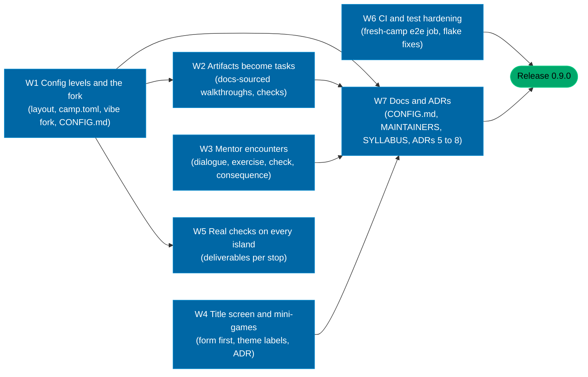

# The brief: what Tom asked for, what happened, what is next

One document that gathers every request Tom made over the first day (2026-09-16 to 2026-09-17), in the order they escalated, weighted so that later requests win over earlier ones. It records what was delivered against each, what is still thin, and the plan for the next cycle: professionalize. Every agent working on this repository reads this first, then `AGENTS.md` and `docs/MAINTAINERS.md`.

## 1. The ask, as one coherent thing

It started as a joke for a wine evening and escalated into a product. The escalation is wanted. The later requests set the direction; the early ones survive only where they do not contradict them.

### The product (what it is)

A gamified course on agentic coding for people who are not (yet) engineers, with three faces that stay in sync: a single-file 3D browser game (the story, the map, the lessons), a terminal companion `vibe` (the checks, the XP, the vault builder, the terminal menu), and an Obsidian vault (the notes that grow as you play). Four islands, thirty-two stops, twelve mentors from the field with their real ideas and sources, twenty artifacts on the island that each explain one concept. Professional look, R2-D2 palette (red, orange, yellow, green, blue on OLED black, no gradients), a playful wine mode kept as a theme. Semantic versions, a changelog, ADRs, a quickstart, an installable CLI that works with Claude Max or Codex. No fantasy, no emoji, no em dashes.

### The learner's journey (how it is played)

1. The game is the entry point. A first visit onboards in the game: who you are (a preset or your own name), how hard, and whether you want just the game or the full experience. The exact commands are shown at every difficulty; folded at the hard levels, never hidden.
2. The full experience adds the terminal and Obsidian. `vibe new` makes a camp named `vibe-map-<name>-<date>`; `just start` is the terminal menu; the game and the camp exchange a progress code; the vault fills as you play (grow mode) or is complete from the start (full mode).
3. Every stop, mentor and artifact leaves something real on the machine, and when the learner plays with the terminal the tool checks it deterministically instead of trusting a click. This is the rule that the professionalize cycle makes true everywhere.
4. The course is also about building the builder: the learner is taught to change the configuration of their own camp, to fork the game into their workspace, and to understand where each kind of setting lives.

### Separation of concerns (the layout)

Three zones, and it must be obvious where to do what: configuration, source, workspace. Configuration has levels that nest: the repository's configuration (tooling, CI, agent rules), the source's configuration (how the game and the CLI are built and themed), and the user-journey configuration (who you are, difficulty, theme, vault mode). Within a level it can be flat again. The learner's own work lives in `workspace/`, including their fork of the game.

### Content rules

- Artifacts and mentors teach real things from real documentation: if an artifact is a container, the learner builds a container, following the official docs, and the tool checks the image exists. If a mentor is Karpathy, the encounter ends with a tiny language model running, not two clicks.
- Roadmap topics cover the craft: prompting (task, goal, hard constraints), structure (XML tags, Markdown blocks), the symbols (`/`, `@`, `!`, `#`), hooks for git and agents, interfaces (GUI, TUI, CLI, API), Obsidian features from the official help, terminal configuration from Tom's toolbox, separation of concerns and building the builder, with sources.
- Personas and difficulties, a pet in the terminal (open source, credited), off-the-shelf icons and animations (credited), a news reader that keeps the game current.
- The played instance (`tpetedb/vibe-map-played`) always shows a finished campaign with screenshots and recordings.

### Ways of working

- Keep working through the night; add new requests to the backlog and parallelise, never stop a task midway because a message arrived.
- Push branches, open PRs, merge only green PRs, release with a tag and notes, install the tool from the tag, regenerate the played instance, leave main clean.
- Nothing that was made may get lost. Review every branch before deleting; every merge is tested in an ephemeral environment by an independent agent; fixes get tests.
- Fable steers; Opus agents play, test, review and fix. Keep the agents aligned with this document and with a dependency plan so that parallel work does not overwrite itself.

## 2. What happened, request by request

| Request (in order) | Delivered in | State |
|---|---|---|
| One-shot game plus CLI plus vault, justfile, personas, difficulties, themes, cookbooks, council, toolbelt, semver skills, note methods, design system, media | v0.1.0 to v0.3.0 | done |
| Remove fantasy, professional look, wine mode as a theme | v0.3.0 | done |
| Semver, CHANGELOG, quickstart, installable CLI (`uv tool install`), Claude Max or Codex backend | v0.3.0, v0.4.x | done; PyPI not yet, install from git |
| Fully played instance with screenshots and recordings | v0.3.0 onward, regenerated every release | done (as a camp since v0.7.0) |
| R2-D2 palette, no gradients | v0.3.0 | done |
| Terminal pet (claude-buddy, MIT, credited) | v0.4.0 | done |
| Off-the-shelf assets: Lucide icons, Motion, d3-force (credited) | v0.4.0 | done |
| Vault graph fixed, real Obsidian where possible | v0.4.0 (d3-force graph, Open in Obsidian) | done; in-game graph is dense (see gaps) |
| Obsidian feature modules from the official docs | v0.4.0 (35 features) | done |
| Toolbox terminal configs installable, hooks (git and agent), interfaces topic | v0.4.0 | done |
| Artifacts that do something (cafe = client and server, then factories, post offices, shops, companies, households, energy grid, data centre) | v0.4.0, v0.5.0 (20 artifacts with demos), v0.9.0 (tasks with checks) | done; see the professionalize cycle below |
| Heartbeat for handover to Opus if limits run out | HANDOVER.md, memory | done (launchd blocked by permissions) |
| Tree grouped by category with depth, not ranks | v0.5.0 | done |
| Grow mode: empty vault that fills as you play, claude-obsidian where fitting | v0.5.0 | done |
| More dropdowns and configs in the game, bigger map, RSS news reader, dummy-proof long-term setup for terminal plus game plus Obsidian | v0.5.0, v0.6.0 (settings, 1.6x map with annexes, news, LONG-GAME.md) | done |
| Do not stop when a message arrives; backlog and parallelise | working rule | done |
| Easy reset of the online game to the roadmap start | v0.5.0 (`?reset`, two-click button) | done |
| Roadmap topics: prompting, XML and Markdown, the symbols | v0.5.0 | done |
| In-game onboarding (character, difficulty, full experience with exact commands), commands foldable, bigger map with a path per module, naming convention | v0.6.0 | done |
| `<your_name>` as the default everywhere, explain to type it plainly | v0.7.0, hardened in v0.8.0 | done |
| Separation of concerns: config, source, workspace; a slim camp; maintainer doc; roadmap topics on separation of concerns and building the builder with real sources | v0.7.0 (three zones, `vibe new` writes a camp, MAINTAINERS.md), v0.9.0 (three config levels, `vibe fork`) | done |
| Review all branches, merge so nothing is lost, test with Opus in ephemeral envs | v0.7.0 review pass (PR #28) | done |
| New test repo, play the whole game, find bugs, Opus agents fix them | v0.8.0 (PRs #29 to #31, test camp `tpetedb/test-20260917-1404`) | done |
| **Professionalize cycle** (one issue and one worktree per workstream) | | |
| W1: config levels and the vibe fork | PR #44 | done |
| W2: artifacts become tasks | PR #46 | done |
| W3: mentor encounters | PR #41 | done |
| W4: title screen and mini-games | PR #43 | done |
| W5: real checks on every island, and the Fork the game stop on production | PR #45 | done |
| W6: CI and test hardening (the whole battery in CI, a nightly workflow, a fresh-camp end-to-end run) | PR #42 | done |
| W7: docs and ADRs | issue #40, this PR | done |

## 3. Gaps, honestly

What the professionalize cycle closed:

- Artifacts are tasks. Each of the twenty keeps its demo and carries a "Do it for real" walkthrough written from the official documentation of the thing, a home in `workspace/artifacts/<id>/` and a deterministic offline check (`vibe check --artifact <id>`). A check that needs a tool this machine does not have says so with the install command instead of failing.
- Mentors are encounters. Each of the twelve has a dialogue of three or four exchanges, every line a paraphrase with its source next to it, one exercise of under fifteen minutes in `workspace/mentors/<id>/`, a check (`vibe check --mentor <id>`), a plaque on the island and a line in their vault note.
- Every winter, desert and production stop with a deliverable is checked on disk, with the note as the floor underneath. Four winter stops are genuinely reading only and say so in the check name: stops 2, 4, 5 and 7 (`quests.READING_ONLY`).
- Configuration has three nested levels with `docs/CONFIG.md` as the table. The journey level is `config/camp.toml`; `vibe.toml` is read for one release and says so on every command. `vibe fork` puts the source level in the learner's hands, and the production island's stop 6 is Fork the game with four challenges.
- The title screen leads with the form; the KPI labels, the button words and the second tagline line follow the theme. The mini-games were audited against what they teach, two were cut and three rebuilt, with the reasoning in `docs/adr/0005-mini-games.md`.

Still open:

- PyPI publication is pending; every install block uses the git URL.
- The in-game vault graph is decoration, and the tech tree has arrows but no search.
- The camp's `pages.yml` copies a built fork to `/fork/` when `workspace/forks/vibe-map/game/vibe-map.html` is committed, so a learner's own game is hosted only if they commit the build. Nothing tells them to, and the forking stop does not mention the URL.
- Palette literals remain in several game modules (`12-buildings.js`, `17-artifact-props.js`, `21-world-build.js`, `60-vault.js`, `70-minigames.js`, `87-onboarding.js`) rather than reading `src/config/00-config.js`.
- The product checkout is a valid camp but does not satisfy the new winter, desert and production checks: its `workspace/` holds the campus deliverables only. The played instance has to script those deliverables before it plays, or the played camp will show red where the course expects green.

## 4. The next cycle: professionalize

Decisions taken here so that agents do not re-litigate them:

- **Config levels.** Three levels, nested, each flat inside:
  - Repository configuration, where the tools demand it: `pyproject.toml`, `justfile`, `.github/`, `.claude/`, `.agents/`. Documented, never moved.
  - Source configuration: `src/config/` for the game (load order, palette, theme presets, world scale, the defaults the build injects) and `vibemap/data/` for the CLI (campaign, tech tree, personas, templates). A learner who forks the game edits `src/config/` in their fork.
  - Journey configuration: `config/camp.toml` in a camp (name, persona, difficulty, provider, theme, vault mode, finale dates). `vibe.toml` at the camp root stays as the marker and is read for one release, then retired. The product repository keeps a `config/camp.toml` too so the checkout remains a valid camp.
  - `docs/CONFIG.md`: one table, "to change X, edit Y".
- **The fork.** `vibe fork` copies the game's source, its vendor files and the build tool into `workspace/forks/vibe-map/` with its own `src/config/`, and `just build` there produces the learner's own game file. A new stop on the production island teaches forking on GitHub and locally, and its check verifies the fork builds and differs from the original in configuration. A fork is a learner feature and never our development workflow: work on the product happens in the product, in a worktree and a branch, never through a fork.
- **Artifacts become tasks.** Every artifact keeps its demo and gains a "Do it for real" section written from the official documentation of the thing (Docker, DuckDB, FastAPI, GitHub Actions, MCP, SQLite, Redis or a Python queue, and so on), a workspace path (`workspace/artifacts/<id>/`) and a deterministic check (`vibe check --artifact <id>`) that looks at what was built: an image that builds, a container that answers, a query that returns rows, an endpoint that responds, a workflow file that is valid. The progress code carries which artifacts were built for real.
- **Mentors become encounters.** Each mentor has a short dialogue (three to four exchanges, sourced, never invented quotes), one exercise in the learner's workspace with a check (`vibe check --mentor <id>`), and a visible consequence on the island (a plaque on the annex, a line in the vault, a badge).
- **Every stop has a real check** where a deliverable exists; the note check stays as the floor.
- **Title screen.** The four-step form comes first, the brief and roles sit below the Go button, KPI labels and the tagline follow the theme, the mini-games are reviewed: keep the ones that teach (prompt, versions, bridges), cut or rebuild the ones that do not (mascot, rolls), and say so in an ADR.
- **Quality bar.** Every PR: full battery green in CI, a fresh-camp end-to-end run by an independent agent before a release, a screenshot looked at. Releases stay small and frequent.

### Dependency plan

Wave 1 (parallel, independent files): W1 (layout and CLI), W3 (game mentors and campaign data), W4 (game title and mini-games), W6 (tests and CI). Wave 2 (after W1 lands): W2 and W5, which write checks against the new workspace layout. Wave 3: W7, then the release. Each workstream is a GitHub issue; each agent works in its own worktree, merges `origin/main` before opening its PR, and touches only the files its issue names.

## 5. The rule for agents

Read this document, `AGENTS.md`, `docs/MAINTAINERS.md`, then the issue. Do the whole issue, with tests. Do not widen scope; note what you saw for another issue in your PR body. Never hand-edit generated files; regenerate. Never delete or rewrite `workspace/data/scores.csv`. No em dashes, no emoji. Merge `origin/main` into your branch before the PR and resolve conflicts by regenerating, not by hand. Green CI or no merge.
