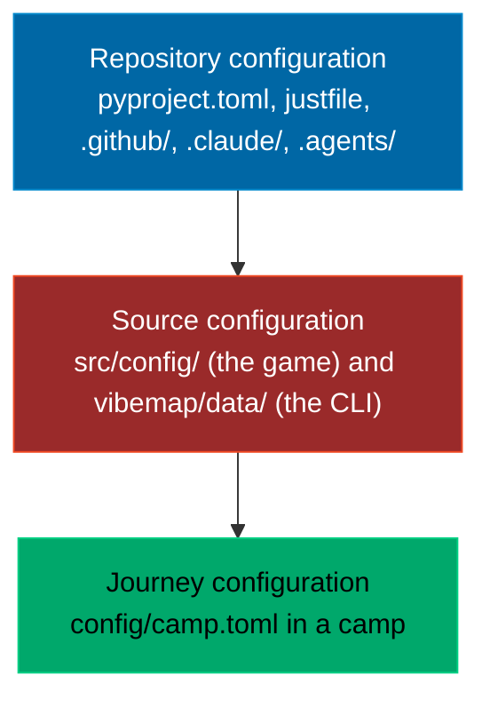

# Configuration: to change X, edit Y

Three levels, nested, each flat inside. The outer level is how the repository
is built and checked, the middle one is how the product itself is made, the
inner one is your own journey through it. A camp has the inner level only.

## In a camp (a learner's folder)

Everything you own is one file plus your workspace. After a change, run the
command in the last column; nothing needs a build.

| To change | Edit | Then |
|---|---|---|
| Your name | `config/camp.toml` `[learner] name` | `vibe name <name>` does it for you |
| Persona, difficulty, mode, provider | `config/camp.toml` `[learner]` | `vibe persona`, `vibe difficulty`, `vibe mode`, `vibe provider` |
| The theme (the voice, the pairings) | `config/camp.toml` `[theme] preset` | `vibe theme <name>`; custom themes live in `themes/` |
| The finale dates | `config/camp.toml` `[finale] dates` | nothing; the game reads them at the next build or from the host |
| Where the vault is, and whether it grows | `config/camp.toml` `[vault]` | `vibe vault mode grow`, then `vibe vault build` |
| The news feeds | `config/camp.toml` `[news] feeds` | `vibe news` |
| The terminal pet | `config/camp.toml` `[pet]` | `vibe pet --species duck` writes it for you |
| Your own agent rules | `AGENTS.md`, `CLAUDE.md`, `.agents/skills/` | nothing; your agent reads them next time |
| Your own work | `workspace/` | `vibe check` |
| What an artifact asked you to build | `workspace/artifacts/<id>/` | `vibe check --artifact <id>` |
| The game itself | `workspace/forks/vibe-map/src/config/` | `vibe fork` first, then `just build` there and `vibe check --fork` |

`vibe.toml` at the camp root was the old name for `config/camp.toml`. It is
still read for one release and the CLI says so on every command; move the file
and the warning goes away.

## In the product (this repository)

| To change | Edit | Then |
|---|---|---|
| The game's world scale, island radius, palette | `src/config/00-config.js` | `just build` |
| A game module (scene, worlds, sheet, boot) | `src/game/*.js`, in load order | `just build` |
| The load order itself | `GAME_ORDER` in `tools/build.py` | `just build` |
| Three.js, Motion, d3-force | `src/vendor/` (never edited by hand) | `just build` |
| The campaign: evenings, stops, mentors, artifacts | `vibemap/data/campaign.json` | `just build` |
| An artifact's Do it for real walkthrough and its check | `vibemap/data/campaign.json` `real` block, kinds in `vibemap/artifact_checks.py` | `just build` |
| The roadmap and the tech tree | `vibemap/tech.py` | `just tree`, then `just build` |
| Themes, personas, difficulties | `vibemap/themes.py`, `personas.py`, `config.py` | `just verify` |
| The camp skeleton `vibe new` writes | `vibemap/data/template/` | `just verify` |
| The skills, the hook, the subagent a camp gets | `.agents/skills/`, `.claude/` | `uv run python tools/sync_template.py` |
| Python dependencies, the version, ruff, pytest | `pyproject.toml` | `uv sync`, `just verify` |
| CI, Pages, the news job | `.github/workflows/` | a PR |
| This checkout's own journey | `config/camp.toml` (it is a camp too) | `just build` |

The repository level is documented, never moved: tools look for those files
where they expect them.

## The fork

`vibe fork` copies `src/`, `tools/build.py` and the generated inputs into
`workspace/forks/vibe-map/`, with its own `src/config/`. Your fork is yours to
break and repair; the course keeps living in the product. Work on the product
happens in the product, never through a fork.

    vibe fork                 # copy it
    cd workspace/forks/vibe-map
    just build                # your own game/vibe-map.html
    vibe check --fork         # it builds, and its configuration is yours

The fork keeps the journey level of the camp it sits in: only `src/config/`
is yours to diverge. `fork.json` records the configuration it started from,
which is how the check knows you changed something.
