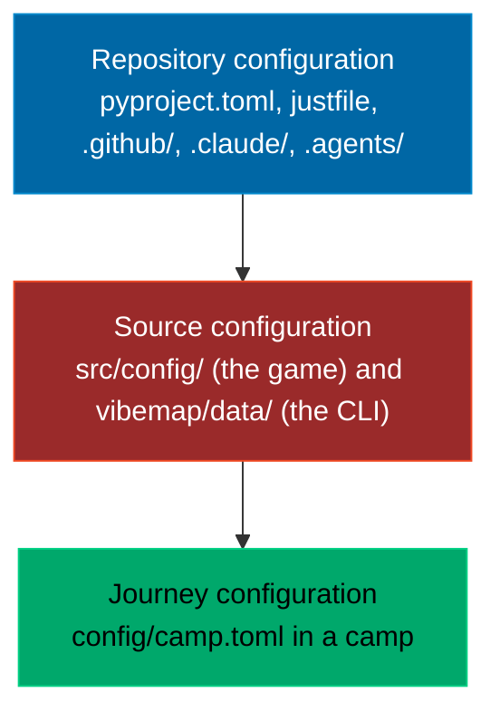

# Configuration: to change X, edit Y

Three levels, nested, each flat inside. The outer level is how the repository
is built and checked, the middle one is how the product itself is made, the
inner one is your own journey through it. A camp has the inner level only.

## In a camp (a learner's folder)

Everything you own is one file plus your workspace. After a change, run the
command in the last column; nothing needs a build.

| To change | Edit | Then |
|---|---|---|
| Your name | `config/camp.toml` `[learner] name` | `vibe name <name>` does it for you |
| Persona, difficulty, mode, provider | `config/camp.toml` `[learner]` | `vibe persona`, `vibe difficulty`, `vibe mode`, `vibe provider` |
| What you want to learn (which shelves come first) | `config/camp.toml` `[learner] interests` | `vibe interests set data,shell,agents`, or `vibe interests all`; the game's Settings panel writes the same choice into the progress code. An empty list means everything, and nothing is ever hidden by a choice |
| The theme (the voice, the pairings) | `config/camp.toml` `[theme] preset` | `vibe theme <name>`; custom themes live in `themes/` |
| The finale dates | `config/camp.toml` `[finale] dates` | nothing; the game reads them at the next build or from the host |
| Where the vault is, and whether it grows | `config/camp.toml` `[vault]` | `vibe vault mode grow`, then `vibe vault build` |
| The live world feed, on or off | `config/camp.toml` `[news] live` | a rebuild, or the Settings dropdown Live world |
| The news feeds | `config/camp.toml` `[news] feeds`, empty means `vibemap/data/sources.json` | `vibe news` |
| The terminal pet | `config/camp.toml` `[pet]` | `vibe pet --species dog` writes it for you; twenty species, six with pixel sprites (cat, crab, dog, duck, snail, turtle) |
| The companion in the game | `config/camp.toml` `[pet] species` and `enabled` | a rebuild; the six with pixel sprites follow the walker on the islands. The player overrides it in the onboarding or in Settings (Companion), and that choice travels in the progress code |
| How the pet is drawn | `config/camp.toml` `[pet] style` | `vibe pet --style pixel` (`auto`, `pixel`, `ascii`); `auto` uses the vendored sprites where a species has them and the terminal has truecolor |
| Your own agent rules | `AGENTS.md`, `CLAUDE.md`, `.agents/skills/` | nothing; your agent reads them next time |
| Your own work | `workspace/` | `vibe check` |
| What an artifact asked you to build | `workspace/artifacts/<id>/` | `vibe check --artifact <id>` |
| The game itself | `workspace/forks/vibe-map/src/config/00-config.js` | `vibe fork` first, then `just build` there and `vibe check --fork config` |
| A stop or a tree node of your own | `workspace/forks/vibe-map/tools/generated/campaign.json` or `tree.js` | `just build` there, then `vibe check --fork topic` |
| The record of a build you broke and repaired | `workspace/forks/vibe-map/repair.json` | `just record` in the fork writes it; `vibe check --fork repair` reads it |
| What an exercise a mentor set asked you to do | `workspace/mentors/<id>/` | `vibe check --mentor <id>` |

`vibe.toml` at the camp root was the old name for `config/camp.toml`. It is
still read for one release and the CLI says so on every command; move the file
and the warning goes away.

## In the product (this repository)

| To change | Edit | Then |
|---|---|---|
| The game's world scale, island radius, palette | `src/config/00-config.js` | `just build` |
| How far apart the four islands sit, and how wide a bridge is | `ISLAND_GAP`, `BRIDGE_W`, `BRIDGE_REST_R` in `src/config/00-config.js` | `just build` |
| Which islands a bridge joins, and where it meets each shore | `BRIDGE_CHAIN` in `src/game/20-worlds.js` | `just build` |
| A game module (scene, worlds, sheet, boot) | `src/game/*.js`, in load order | `just build` |
| The load order itself | `GAME_ORDER` in `tools/build.py` | `just build` |
| Three.js, Motion, d3-force | `src/vendor/` (never edited by hand) | `just build` |
| The campaign: evenings, stops, mentors, artifacts | `vibemap/data/campaign.json` | `just build` |
| An artifact's Do it for real walkthrough and its check | `vibemap/data/campaign.json` `real` block, kinds in `vibemap/artifact_checks.py` | `just build` |
| The roadmap and the tech tree | one TOML file per topic in `vibemap/data/topics/<pack>/` (`tools/new_topic.py` scaffolds one; see `docs/TOPICS.md`) | `just tree`, then `just build` |
| Themes, personas, difficulties | `vibemap/themes.py`, `personas.py`, `config.py` | `just verify` |
| The camp skeleton `vibe new` writes | `vibemap/data/template/` | `just verify` |
| The skills, the hook, the subagent a camp gets | `.agents/skills/`, `.claude/` | `uv run python tools/sync_template.py` |
| Python dependencies, the version, ruff, pytest | `pyproject.toml` | `uv sync`, `just verify` |
| CI, Pages, the news job | `.github/workflows/` | a PR |
| This checkout's own journey | `config/camp.toml` (it is a camp too) | `just build` |

The repository level is documented, never moved: tools look for those files
where they expect them.

## The fork

`vibe fork` copies `src/`, `tools/build.py`, `tools/record_build.py` and the
generated inputs into `workspace/forks/vibe-map/`, with its own `src/config/`,
a `justfile`, a `README.md` with the four challenges and a versioned
`fork.json`. Your fork is yours to break and repair; the course keeps living
in the product. A fork is a learner feature and never our development
workflow: work on the product happens in the product, in a worktree and a
branch, never through a fork.

    vibe fork                 # copy it
    cd workspace/forks/vibe-map
    just build                # your own game/vibe-map.html
    just record               # run the build and record whether it passed
    vibe check --fork         # all four challenges at once

The fork keeps the journey level of the camp it sits in: only `src/config/`
is yours to diverge. `fork.json` records the configuration it started from,
which is how the check knows you changed something.

The four challenges of the production island's stop 6 are checked one at a
time. Each one reads something that is on your disk.

| Challenge | It reads | Command |
|---|---|---|
| `exists` | `workspace/forks/vibe-map/` with `fork.json` and its own `src/config/` | `vibe check --fork exists` |
| `config` | `src/config/00-config.js` differs from the product's, and the fork still builds | `vibe check --fork config` |
| `topic` | a stop id in `tools/generated/campaign.json` or a node id in `tools/generated/tree.js` that the product does not have | `vibe check --fork topic` |
| `repair` | `repair.json`, a failed build followed by a green one, else the fork's git history | `vibe check --fork repair` |

`repair.json` is written by `just record` in the fork, which runs
`tools/record_build.py`: it builds, appends the run with its result, and keeps
the file at its own version. An unknown version is refused with the line that
tells you to delete it and record the runs again. Without the file the check
falls back to the fork's git history, where a commit that breaks the build
followed by one that fixes it counts as the same evidence.
