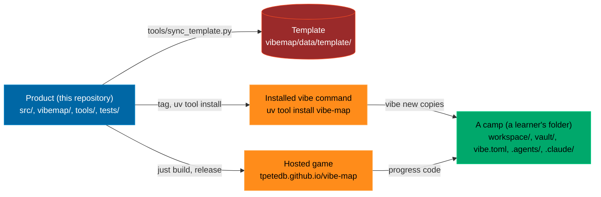

# Maintainers: how this repository is laid out and why

Read this before changing anything. It explains the three zones, which one a file belongs to, and how a change in one reaches the others. The learner-facing version of the same idea is the `README.md` that `vibe new` writes into a camp.

## The problem it solves

A learner should start in an empty folder that is theirs and build up from there. The product that makes that possible (the game, the `vibe` command, the checks, the tests) is a lot of code, and it should not be lying around in the learner's folder, because a beginner cannot tell "the thing I am learning with" from "the thing I am building" from "the settings that make my agent behave". Three concerns, three homes.

## Three zones

| Zone | Where | What belongs there | Who edits it |
|---|---|---|---|
| **Product** | `src/`, `game/vibe-map.html`, `vibemap/` (except `data/template/`), `tools/`, `tests/`, `pyproject.toml`, `uv.lock`, `docs/` | Everything that makes the course work: the game's source and its one-file build, the terminal companion, the checks and XP, the vault builder, the tech tree, the tests. | Maintainers and their agents, through `just verify` and a PR. |
| **Template** | `vibemap/data/template/` | The skeleton of a camp: `README.md`, `AGENTS.md`, `CLAUDE.md`, `vibe.toml`, `justfile`, `env.example`, `workspace/README.md`, `_gitignore`, `_claude/` (hook and subagent), `_agents/skills/` (the learner skills), `_github/workflows/pages.yml`. Dot-folders are stored with an underscore so packaging and git never skip them; `vibe new` puts the dots back. | Maintainers. The skills, the hook and the subagent are copied from this repository's own `.agents/` and `.claude/` by `tools/sync_template.py`; a test fails when they drift. |
| **Workspace** | `workspace/` in a camp, and in this repository | The learner's own work: `workspace/game/index.html` (workstream 1), `workspace/data/scores.csv`, `workspace/sql/`, `workspace/python/` (workstream 3) and anything else. Nothing in the product depends on its contents; the checks in `vibemap/quests.py` only read it. | The learner. In this repository the folder holds the worked example (Lotte's game, the sample scores) so the tests and the play-through have something to check. |

The remaining top-level files are this repository's own **configuration for agents and CI**: `AGENTS.md`, `CLAUDE.md`, `.agents/skills/` (fourteen skills; `develop-camp` is product-only and stays out of the template), `.claude/` (the backup hook and the scorekeeper subagent), `.github/workflows/` (ci, pages, news), `justfile` and `agents.just`. The camp gets its own, smaller set of the same things from the template.

## How a change travels

| You changed | Then | It reaches the learner through |
|---|---|---|
| `src/` (the game) | `just build`, `just verify`, PR, release | the hosted game after Pages deploys; `vibe play --offline` caches a copy from `main` |
| `vibemap/` (the CLI, the checks, the vault) | `just verify`, PR, release, tag | `uv tool install --force git+https://github.com/tpetedb/vibe-map@vX.Y.Z` |
| `vibemap/tech.py` (the roadmap) | `just tree` (regenerates the notes, the tree JS, `docs/ROADMAP.md`), `just build` | both of the above |
| `.agents/skills/`, `.claude/settings.json`, `.claude/agents/scorekeeper.md` | `uv run python tools/sync_template.py`, then `just verify` | `vibe new` on the next install; existing camps copy what they want |
| `vibemap/data/template/` (README, AGENTS, justfile, vibe.toml, pages.yml) | edit in place, `just verify` (`tests/test_onboarding.py` runs `vibe new` into a temp folder) | `vibe new` on the next install |
| `workspace/` in this repository | nothing else; it is the worked example | never; each camp has its own |

## What a camp contains and what it does not

`vibe new` writes about twenty files and builds the vault. It does not write `src/`, `vibemap/`, `tools/`, `tests/` or `pyproject.toml`: a camp has no Python project of its own and no build. Its `justfile` calls the installed `vibe` directly. `vibe play` opens the hosted game (or the local build when run inside this repository, or a cached copy after `vibe play --offline`). Progress moves between the game and the camp as a code (`vibe export`, `vibe import`), never as files.

People who want the engine press **Use this template** on GitHub or clone this repository; then they have a product checkout that is also a valid camp (it has a `vibe.toml` and a `workspace/`), which is how the tests and the played instance work.

## Where the rules live

- `AGENTS.md` (this repository): the file map, ways of working, the test loop, code style. Every agent reads it through `CLAUDE.md`.
- `vibemap/data/template/AGENTS.md`: the same for a camp, shorter, with the zones table and the rule that `workspace/data/scores.csv` is a system of record.
- `docs/adr/`: decisions with their why.
- `CHANGELOG.md`: Keep a Changelog form; `Unreleased` is cut into a section at release time (`docs/QUICKSTART.md` and the release script in the session notes describe the steps).

## The idea behind it

Separation of concerns is Dijkstra's phrase (EWD 447, 1974): study one aspect at a time, in isolation, without pretending the others do not exist. Parnas (1972) says where to cut: around the decisions most likely to change, hiding each behind an interface. Here the decisions are "how the game is built", "what a camp starts with" and "what the learner makes", and each has one folder. The roadmap teaches both ideas under "Separation of concerns" and "Building the builder" (the meta step: this template, these skills and this document exist to make the next build, by you or by an agent, cheaper), with the sources.
