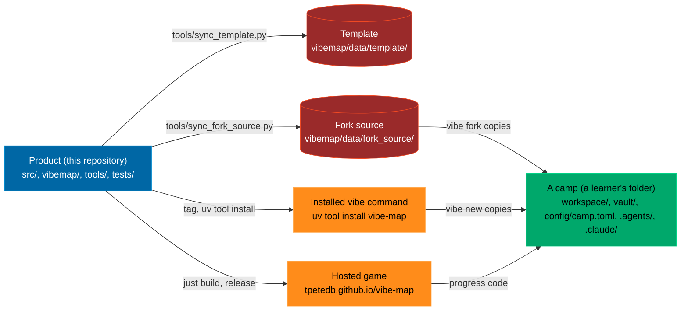

# Maintainers: how this repository is laid out and why

Read this before changing anything. It explains the three zones, which one a file belongs to, and how a change in one reaches the others. The learner-facing version of the same idea is the `README.md` that `vibe new` writes into a camp.

## The problem it solves

A learner should start in an empty folder that is theirs and build up from there. The product that makes that possible (the game, the `vibe` command, the checks, the tests) is a lot of code, and it should not be lying around in the learner's folder, because a beginner cannot tell "the thing I am learning with" from "the thing I am building" from "the settings that make my agent behave". Three concerns, three homes.

## Three zones

| Zone | Where | What belongs there | Who edits it |
|---|---|---|---|
| **Product** | `src/`, `game/vibe-map.html`, `vibemap/` (except `data/template/`), `tools/`, `tests/`, `pyproject.toml`, `uv.lock`, `docs/` | Everything that makes the course work: the game's source and its one-file build, the terminal companion, the checks and XP, the vault builder, the tech tree, the tests. | Maintainers and their agents, through `just verify` and a PR. |
| **Template** | `vibemap/data/template/` | The skeleton of a camp: `README.md`, `AGENTS.md`, `CLAUDE.md`, `config/camp.toml`, `justfile`, `env.example`, `workspace/README.md`, `_gitignore`, `_claude/` (hook and subagent), `_agents/skills/` (the learner skills), `_github/workflows/pages.yml`. Dot-folders are stored with an underscore so packaging and git never skip them; `vibe new` puts the dots back. | Maintainers. The skills, the hook and the subagent are copied from this repository's own `.agents/` and `.claude/` by `tools/sync_template.py`; a test fails when they drift. |
| **Workspace** | `workspace/` in a camp, and in this repository | The learner's own work: `workspace/game/index.html` (workstream 1), `workspace/data/scores.csv`, `workspace/sql/`, `workspace/python/` (workstream 3), `workspace/artifacts/<id>/` (what an artifact's Do it for real task asked them to build), `workspace/mentors/<id>/` (the exercise a mentor set), `workspace/forks/vibe-map/` (their own copy of the game, from `vibe fork`), the island folders `workspace/winter/`, `workspace/desert/`, `workspace/specs/`, `workspace/jobs/`, `workspace/evals/`, `workspace/agents/` and `workspace/dotfiles/`, and anything else. Nothing in the product depends on its contents; the checks in `vibemap/quests.py` only read it. | The learner. In this repository the folder holds the worked example (Lotte's game, the sample scores) so the tests and the play-through have something to check. |

`config/camp.toml` is this checkout's journey configuration, which is what makes it a valid camp; `docs/CONFIG.md` has the three configuration levels and the table of which setting lives where. Three more things sit at the top level of the product and belong to it: `data/news.json` (the world feed `vibe news` pulls from `vibemap/data/sources.json`, baked into the game by the build and copied to `game/news.json` for the runtime refresh; a camp keeps its copy in `.vibe/`), `scripts/setup.sh` (the machine setup for a product checkout) and `HANDOVER.md` (the note for the next session). The remaining top-level files are this repository's own **configuration for agents and CI**: `AGENTS.md`, `CLAUDE.md`, `.agents/skills/` (fifteen skills; `develop-camp` is product-only and stays out of the template), `.claude/` (the backup hook and the scorekeeper subagent), `.github/workflows/` (ci, pages, news), `justfile` and `agents.just`. The camp gets its own, smaller set of the same things from the template.

## How a change travels

| You changed | Then | It reaches the learner through |
|---|---|---|
| `src/config/` (world scale, palette) or `src/` (the game) | `just build`, `just verify`, PR, release | the hosted game after Pages deploys; `vibe play --offline` caches a copy from `main` |
| `vibemap/` (the CLI, the checks, the vault) | `just verify`, PR, release, tag | `uv tool install --force git+https://github.com/tpetedb/vibe-map@vX.Y.Z` |
| `vibemap/tech.py` (the roadmap) | `just tree` (regenerates the notes, the tree JS, `docs/ROADMAP.md`), `just build` | both of the above |
| an artifact's `real` block in `vibemap/data/campaign.json` (the Do it for real walkthrough, the doc link, the check spec) | `just build` (the campaign is injected into the game), `just verify` | the hosted game for the walkthrough, `uv tool install` for the check |
| `vibemap/artifact_checks.py` (a check kind, one function per kind, named from the `real` block) | `just verify` (`tests/test_artifact_tasks.py`), PR, release, tag | `uv tool install`, as any CLI change |
| a mentor encounter: the `encounter` dialogue and exercise in `vibemap/data/campaign.json`, plus `mentor_quest` in `vibemap/quests.py` | `just build`, `just verify`; every dialogue line needs its source index | the hosted game for the dialogue and the plaque, `uv tool install` for `vibe check --mentor <id>` |
| `src/config/00-config.js` alone (world scale, island radius, palette) | `just build`; a learner's fork has its own copy, so nothing in `tools/build.py` may assume the product's path | the hosted game, and a fork after `just build` there |
| `src/`, `src/vendor/`, `tools/build.py` or `tools/generated/` | `uv run python tools/sync_fork_source.py`, then `just verify`; the mirror in `vibemap/data/fork_source/` is what an installed `vibe fork` copies into a camp, and a test fails when it drifts | `uv tool install`, then `vibe fork` in any camp |
| `.agents/skills/`, `.claude/settings.json`, `.claude/agents/scorekeeper.md` | `uv run python tools/sync_template.py`, then `just verify` | `vibe new` on the next install; existing camps copy what they want |
| `vibemap/data/template/` (README, AGENTS, justfile, config/camp.toml, pages.yml) | edit in place, `just verify` (`tests/test_onboarding.py` runs `vibe new` into a temp folder) | `vibe new` on the next install |
| `workspace/` in this repository | nothing else; it is the worked example | never; each camp has its own |
| `vibemap/quests.py` extra checks | remember a camp has no `tests/` and no `just verify`: expert runs the learner's `workspace/**/test_*.py`, god adds the vault lint | `uv tool install`, as any CLI change |

## What a camp contains and what it does not

`vibe new` writes about thirty files and builds the vault. It does not write `src/`, `vibemap/`, `tools/`, `tests/` or `pyproject.toml`: a camp has no Python project of its own and no build. Its `justfile` calls the installed `vibe` directly. `vibe play` opens the hosted game (or the local build when run inside this repository, or a cached copy after `vibe play --offline`). Progress moves between the game and the camp as a code (`vibe export`, `vibe import`), never as files.

People who want the engine press **Use this template** on GitHub or clone this repository; then they have a product checkout that is also a valid camp (it has a `config/camp.toml` and a `workspace/`), which is how the tests and the played instance work.

## Branch protection

`main` is protected on GitHub, and the rules hold for admins too:

- Changes reach `main` only through a pull request whose two CI jobs (lint, unit tests, generated files in sync; Playwright in Chromium and WebKit) are green and whose branch is up to date with `main`.
- No force pushes, no deletion, review threads resolved before merge.
- Release tags `v*` are immutable (a tag ruleset refuses updates and deletion).
- Branches are deleted automatically after their pull request merges.
- Secret scanning with push protection and Dependabot security updates are on. The played instance `tpetedb/vibe-map-played` refuses force pushes and deletion of `main` but takes direct pushes, because its regeneration script writes to it.

An agent that hits one of these rules reports it; it never works around it.

## Where the rules live

- `AGENTS.md` (this repository): the file map, ways of working, the test loop, code style. Every agent reads it through `CLAUDE.md`.
- `vibemap/data/template/AGENTS.md`: the same for a camp, shorter, with the zones table and the rule that `workspace/data/scores.csv` is a system of record.
- `docs/adr/`: decisions with their why.
- `CHANGELOG.md`: Keep a Changelog form; `Unreleased` is cut into a section at release time (`docs/QUICKSTART.md` and the release script in the session notes describe the steps).

## The idea behind it

Separation of concerns is Dijkstra's phrase (EWD 447, 1974): study one aspect at a time, in isolation, without pretending the others do not exist. Parnas (1972) says where to cut: around the decisions most likely to change, hiding each behind an interface. Here the decisions are "how the game is built", "what a camp starts with" and "what the learner makes", and each has one folder. The roadmap teaches both ideas under "Separation of concerns" and "Building the builder" (the meta step: this template, these skills and this document exist to make the next build, by you or by an agent, cheaper), with the sources.
